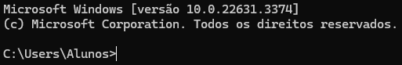

# .jar

**Requisitos para rodar**
- JDK Development Kit 22 ou superior (https://www.oracle.com/br/java/technologies/downloads/#java22)
- Windows 7 ou superior

Para rodar o arquivo .jar, é necessário clonar o repositório e manter o nome do arquivo no seu computador como `DISC-POO-2024.1-T01`, a pasta do repositório deve estar localizada dentro da pasta que é mostrada no cmd quando ele é aberto:

*Pasta do repositório deve estar dentro do diretório que aparece assim que o cmd é aberto*
